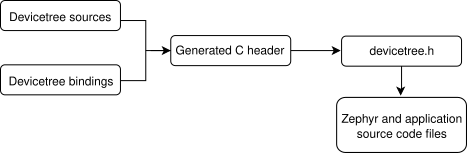

> 直接看 Zephyr 官方文档更快点。

# [Devicetree versus Kconfig](https://docs.zephyrproject.org/latest/build/dts/dt-vs-kconfig.html#dt-vs-kconfig)

除了设备树之外，Zephyr 还使用 Kconfig 语言来配置源代码。对于特定用途，究竟应该使用设备树还是 Kconfig 有时会令人困惑。

简而言之：

1. 使用设备树描述**硬件**及其**启动时配置** 。例如，电路板上的外设、启动时时钟频率、中断线等。
2. 使用 Kconfig 配置要构建到最终映像中的**软件支持** 。例如，是否添加网络支持、应用程序需要哪些驱动程序等等。

换句话说，devicetree 主要处理硬件，而 Kconfig 处理软件。

# [Scope and purpose](https://docs.zephyrproject.org/latest/build/dts/intro-scope-purpose.html)

设备树主要是一种描述硬件的分层数据结构。[ 设备树规范](https://www.devicetree.org/)定义了其源代码和二进制表示形式。

Zephyr 使用 devicetree 来描述：

1. 其[支持的主板和扩展板上](https://docs.zephyrproject.org/latest/boards/index.html#boards)可用的硬件；
2. 该硬件的初始配置

因此，devicetree 既是 Zephyr 的硬件描述语言，也是 Zephyr 的配置语言。

有两种类型的设备树输入文件： devicetree sources 和 devicetree bindings 。源文件包含设备树本身。绑定文件描述其内容，包括数据类型。[ 构建系统](https://docs.zephyrproject.org/latest/build/index.html#build-overview)使用设备树源文件和绑定文件生成一个 C 语言头文件。生成的头文件的内容通过 `devicetree.h`  API 抽象化，可以使用 `devicetree.h` 从设备树中获取信息。

以下是该过程的简化视图：

所有 Zephyr 和应用程序源代码文件都可以包含和使用 `devicetree.h` 。这包括[设备驱动程序 ](https://docs.zephyrproject.org/latest/kernel/drivers/index.html#device-model-api)， [应用程序 ](https://docs.zephyrproject.org/latest/develop/application/index.html#application)、[ 测试 ](https://docs.zephyrproject.org/latest/develop/test/index.html#testing)、内核等。

API 本身基于 C 语言宏。所有宏名均以 `DT_` 开头。通常，如果您在 Zephyr 源文件中看到以 `DT_` 开头的宏，则它很可能是 `devicetree.h` 宏。生成的 C 头文件也包含以 `DT_` 开头的宏；您可能会在编译器错误消息中看到这些宏。您始终可以区分生成的宏和非生成的宏：生成的宏包含一些小写字母，而 `devicetree.h` 宏名则全部大写。

# Syntax and structure