# 1 Basic Concept

## 1.1 Paring and Bonding

**Paring（配对）** ，配对包括配对能力交换，设备认证，密钥生成，连接加密以及机密信息分发等过程，配对的目的有三个：加密连接，认证设备，以及生成密钥。从手机角度看，一旦设备跟手机配对成功，蓝牙配置菜单将包含该配对设备，如下所示：

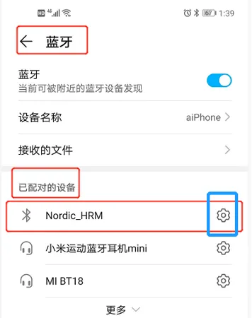

如果用户需要主动删除配对设备，点击配对设备右边的“设置”菜单，出现如下界面，选择“取消配对”或者“忽略该设备”，设备的配对信息即被手机删除。

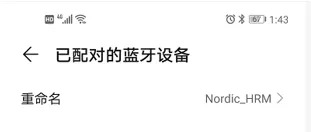
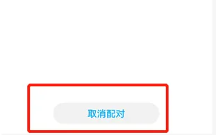

**Bonding（绑定）** ，配对过程中会生成一个长期密钥（LTK，long-term Key），如果配对双方把这个LTK存储起来放在Flash中，那么这两个设备 **再次重连** 的时候，就可以跳过配对流程，而直接使用LTK对蓝牙连接进行加密，设备的这种状态称为bonding。如果paring过程中不存储LTK（不分发LTK）也是可以的，paring完成后连接也是加密的，但是如果两个设备再次重连，那么就需要重走一次paring流程，否则两者还是明文通信。

在不引起误解的情况下，我们经常把paring当成paring和bonding两者的组合，因为只paring不bonding的应用情况非常少见。在不引起混淆的情况下，下文就不区分paring和bonding的区别，换句话说，我们会把paring和bonding两个概念等同起来进行混用。

## 1.2 Others

**SM（security manager）** ，蓝牙协议栈的安全管理层，规定了跟蓝牙安全通信有关的所有要素，包括paring，bonding，以及下文提到的SMP。

**SMP（security manager protocol）** ，安全管理协议，SMP着重两个设备之间的蓝牙交互命令序列，对paring的空中包进行了严格时序规定。

**OOB（out of band，带外）** ，OOB就是不通过蓝牙射频本身来交互，而是通过比如人眼，NFC，UART等带外方式来交互配对信息，在这里人眼，NFC，UART通信方式就被称为OOB通信方式。

**Passkey** ，又称pin码，是指用户在键盘中输入的一串数字，以达到认证设备的目的。低功耗蓝牙的passkey必须为6位。

**Numeric comparison** （数字比较），numeric comparison其实跟passkey一样，也是用来认证设备的，只不过passkey是通过键盘输入的，而numeric comparison是显示在显示器上的，numeric comparison也必须是6位的数字。

**MITM（man in the middle）** ，MITM是指A和B通信过程中，C会插入进来以模拟A或者B，并且具备截获和篡改A和B之间所有通信报文的能力，从而达到让A或者B信任它，以至于错把C当成B或者A来通信。如果对安全要求比较高，需要具备MITM保护能力，在SM中这个是通过认证（authentication）来实现的，SM中实现认证的方式有三种：OOB认证信息，passkey以及numeric comparison，大家根据自己的实际情况，选择其中一种即可。

**LESC（LE secure connections）** ，又称SC，蓝牙4.2引入的一种新的密钥生成方式和验证方式，SC通过基于椭圆曲线的Diffie-Hellman密钥交换算法来生成设备A和B的共享密钥，此密钥生成过程中需要用到公私钥对，以及其他的密码算法库。LESC同时还规定了相应的通信协议以生成该密钥，并验证该密钥。需要注意的是LESC对paring的其他方面也会产生一定的影响，所以我们经常会把LESC看成是一种新的配对方式。

**Legacy paring** ，在LESC引入之前的密钥生成方式，称为legacy paring，换句话说，legacy paring是相对LESC来说的，不支持LESC的配对即为legacy paring（legacy配对）。

**TK（Temporary Key，临时密钥）** ，legacy paring里面的概念，如果采用just work配对方式，TK就是为全0；如果采用passkey配对方式，TK就是passkey；如果采用OOB配对方式，TK就是OOB里面的信息。

**STK（short term key，短期密钥）** ，legacy配对里面的概念，STK是通过TK推导出来的，通过TK对设备A和B的随机数进行加密，即得到STK。

**LTK（long term key，长期密钥）** ，legacy配对和LESC配对都会用到LTK，如前所述，LTK是用来对未来的连接进行加密和解密用的。Legacy paring中的LTK由从设备根据相应的算法自己生成的（LTK生成过程中会用到EDIV（分散因子）和Rand（随机数）），然后通过蓝牙空中包传给主机。LESC配对过程中，先通过Diffie-Hellman生成一个共享密钥，然后这个共享密钥再对设备A和B的蓝牙地址和随机数进行加密，从而得到LTK，LTK由设备A和B各自同时生成，因此LTK不会出现在LESC蓝牙空中包中，大大提高了蓝牙通信的安全性。

**IRK（Identity Resolving Key，蓝牙设备地址解析密钥）** ，有些蓝牙设备的地址为可解析的随机地址，比如iPhone手机，由于他们的地址随着时间会变化，那如何确定这些变化的地址都来自同一个设备呢？答案就是IRK，IRK通过解析变化的地址的规律，从而确定这些地址是否来自同一个设备，换句话说，IRK可以用来识别蓝牙设备身份，因此其也称为Identity information。IRK一般由设备出厂的时候按照一定要求自动生成。

**Identity Address（设备唯一地址）** ，蓝牙设备地址包括public，random static， private resolvable，random unresolved共四类。如果设备不支持privacy，那么identity address就等于public或者random static设备地址。如果设备支持privacy，即使用private resolvable蓝牙设备地址，在这种情况下，虽然其地址每隔一段时间会变化一次，但是identity address仍然保持不变，其取值还是等于内在的public或者random static设备地址。Identity Address和IRK都可以用来唯一标识一个蓝牙设备。

**IO capabilities（输入输出能力）** ，是指蓝牙设备的输入输出能力，比如是否有键盘，是否有显示器，是否可以输入Yes/No两个确认值。

**Key size（密钥长度）** ，一般来说，密钥默认长度为16字节，为了适应一些低端的蓝牙设备处理能力，你也可以把密钥长度调低，比如变为10个字节。

# 2 Pairing 流程

Paring包含三个阶段：

阶段1：配对特性交换，即交换各自都支持哪些配对特性，比如支不支持SC，支不支持MITM，支不支持OOB，以及它的输入输出能力等

阶段2：密钥生成阶段，legacy paring和LESC paring两者的区别就在这里，因此后续我们会分开阐述legacy paring和SC paring的阶段2

- Legacy paring：STK生成（注：legacy paring的LTK生成跟配对流程无关，如前所述，其是由从机自己生成的）
- SC paring：LTK生成

阶段3：通过蓝牙空中包分发一些秘密信息。Legacy paring需要分发LTK，IRK等，而SC paring只需分发IRK。秘密信息分发之前，必须保证连接已加密。

Paring流程如下所示：

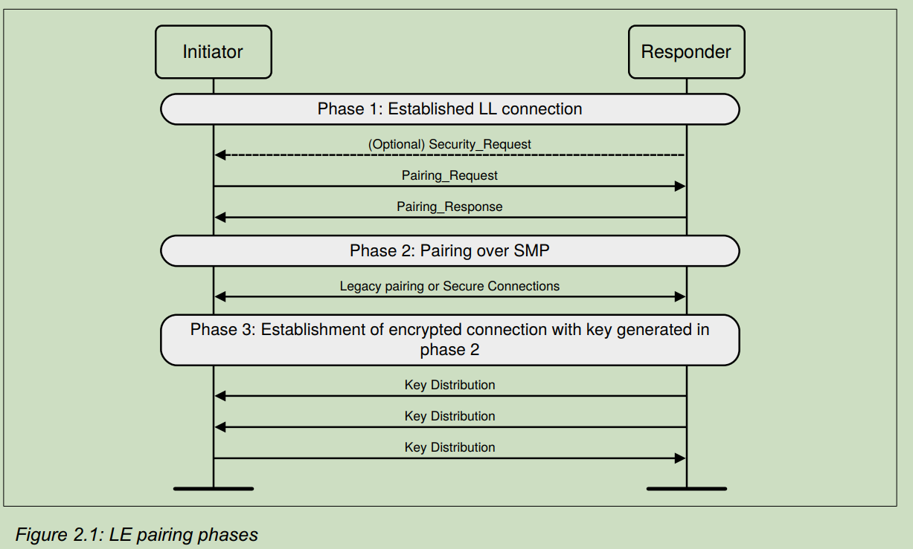

## 2.1 Pairing Feature Exchange

当配对开始时，**配对特性交换（Pairing Feature Exchange）** 应由 **发起设备（initiating device）** 启动。如果响应设备不支持配对，或者无法执行配对，那么响应设备应当使用 **配对失败（Pairing Failed）** 消息进行响应，并携带错误码 **“不支持配对（Pairing Not Supported）”**；否则，它应当使用 **配对响应（Pairing Response）** 消息进行回应。

**配对特性交换（Pairing Feature Exchange）** 用于交换以下信息：IO 能力、OOB 认证数据可用性、认证需求、密钥长度需求，以及需要分发的传输层特定密钥。  
其中，IO 能力、OOB 认证数据可用性和认证需求会用于确定在 **第二阶段（Phase 2）** 中所采用的密钥生成方法。
### Pairing Request

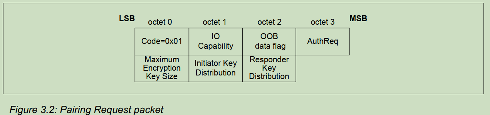

- IO Capability (1 octet)

  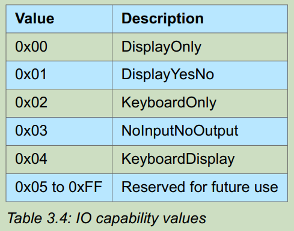

- OOB data flag (1 octet)

  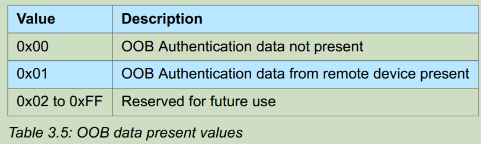

- AuthReq (1 octet)
  
	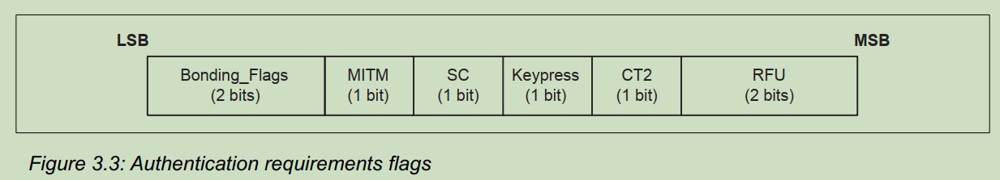
  
	- Bonding_Flags field(2-bit field)
	  
	    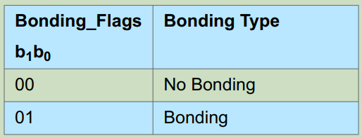
	    
	    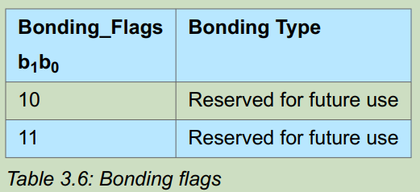
	    
	- MITM(1-bit flag): Man in the Middle
	
	- SC field(1-bit flag): Passkey Entry protocol，当双方都将该字段设置为 1 时，应当生成并发送 **按键通知（Keypress notifications）**，其传输使用 **SMP 配对按键通知 PDU（SMP Pairing Keypress Notification PDUs）**。
	
	- CT2 field(1-bit flag): indicate support for the h7 function
	
- Maximum Encryption Key Size (1 octet): 该值定义了设备所能支持的 **最大加密密钥长度**（以字节为单位）。最大密钥长度必须在 **7 到 16 字节**的范围内。
- Initiator Key Distribution / Generation (1 octet): **发起方密钥分发/生成字段（Initiator Key Distribution / Generation field）** 指示发起方在 **传输层特定密钥分发阶段（Transport Specific Key Distribution phase，见第 2.4.3 节）** 请求分发、生成或使用的密钥。
- Responder Key Distribution / Generation (1 octet): **响应方密钥分发/生成字段（Responder Key Distribution / Generation field）** 指示发起方在 **传输层特定密钥分发阶段（Transport Specific Key Distribution phase，见第 2.4.3 节）** 请求响应方分发、生成或使用的密钥。

### Pairing Response

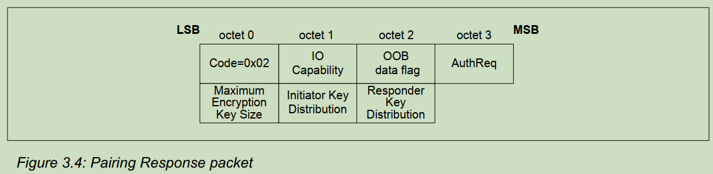

### Security Request

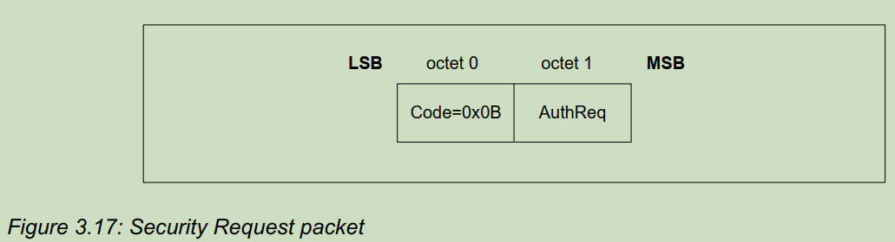

## 2.2 Key Generation

根据阶段1的IO输入输出能力以及是否存在OOB，阶段2存在如下几种配对方式（或者说认证方式）：
- Just works
- Numeric comparison（LESC才有）
- Passkey
- OOB

### 2.2.1 Legacy Pairing

### Pairing Confirm

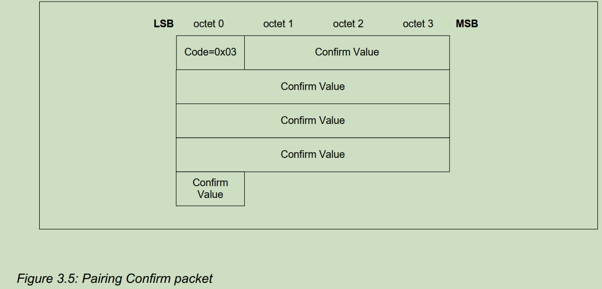